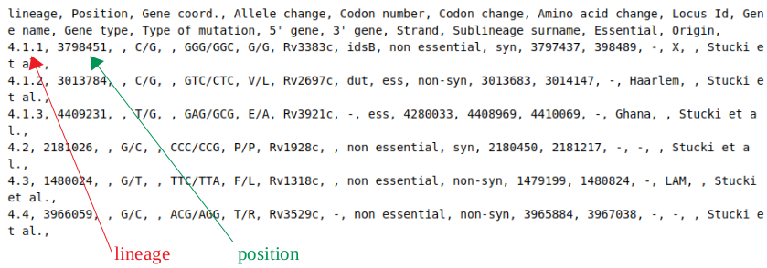
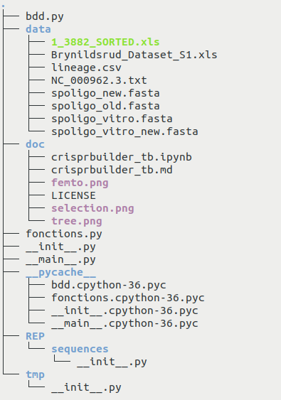

# Documentation for CRISPRbuilder_TB


The CRISPRbuilder_TB package is an open source software made available under generous terms. Please see the LICENSE file for further details.

If you use CRISPRbuilder_TB in work contributing to a scientific publication, we ask that you cite the following application note: Femto-ST Institute, UMR 6174 CNRS, University of Bourgogne Franche-Comté, France.

This package originated in the work of [[1]](#id1) and [[2]](#id2).


## Purpose of this package

CRISPRbuilder_TB will help you collect and annotate Mycobacterium tuberculosis whole genome sequencing data for CRISPR investigations. Given a Sequence Read Archive reference, the package will provide the genome information dictionary comprising the following elements:

* the reads - number of reads for the study, length of those reads, coverage of the study,

* the study - source of publication for the SRA reference, authors who discovered it, location of discovery, date of discovery, center that discovered the SRA, reference of the study, study accession number,

* identity - name of the SRA reference, strain for the SRA, taxid, bioproject number,

* spoligotypes - description, numbers, new version numbers, vitro description, vitro numbers, vitro new version description, vitro new version numbers, Spoligotype International Type, Spoligotype International Type silico,

* lineages - Coll et al. 2014 (for all lineages) [[Coll]](#id3), Stucki et al. 2016 (for Lineage 4) [[Stucki]](#id4), Palittapongarnpim et al. 2018 (for Lineage 1) [[Pali]](#id5), Shitikov et al. 2017 (for Lineage 2) [[Shitikov]](#id6).

## How to install the package ?

This package comes with a Command Line Interface, so it should be installed and executed using your command prompt. For Linux, MacOS or Windows platforms, the installation requires the same instruction. Go the the directory you want the package to be stored to and write in your command prompt:

    pip install crisprbuilder_tb

Please note that `cripsrbuilder_tb` is written without capital letters.
Make sure your system is set to Python 3 in your current directory before using the `pip` instruction. The default version on your computer might be different.

## How to use the Command Line Interface ?

After installing the package, you can find help with the command prompt, listing the different available options, such as `--collect`, `--list`, `--add`, `--print`, `--remove`, `--change`, and their expected syntax. Stay in the directory containing the installed package and write in the command prompt:

    python -m crisprbuilder_tb --help

The help menu will display the following information:

    usage: crisprbuilder_tb [-h] [--collect] [--list] [--add] [--remove] [--change] [--print] sra

    Collects and annotates Mycobacterium tuberculosis whole genome sequencing data for CRISPR investigation.

    positional arguments:
      sra         requires the reference of a SRA, the path to a file of SRA references or 0. See doc.

    optional arguments:
      -h, --help  show this help message and exit
      --collect   collects the reference of a SRA to get information about this SRA. See doc.
      --list      collects the path to a file of SRA references to get information about. See doc.
      --add       collects data to add to the file data/lineage.csv. Requires 0 as argument. See doc.
      --remove    removes data from the file data/lineage.csv. Requires 0 as argument. See doc.
      --change    collects data to update the file data/lineage.csv. Requires 0 as argument. See doc.
      --print     prints the file data/lineage.csv. Requires 0 as argument. See doc.

### Executing CRISPRbuilder_TB with a SRA reference

You can run the package if you wish to find information regarding a specific SRA. From your current directory, write in the command prompt:

    python -m crisprbuilder_tb --collect {SRA_reference}

Please note the importance of "-m" to run crisprbuilder_tb as a package. 
CRISPRbuilder_TB uses version 3 of Python, so make sure your system is set to Python 3 in your current directory before using the `python`instruction. The default version on your computer might be different.

**Caution:** it is not recommanded to find the location of the package and go to the directory containing CRISPRbuilder_TB in order to execute it. If you are doing so, the instruction above won't work.

**Exemple:** to find information about SRR8368696, write:

    python -m crisprbuilder_tb --collect SRR8368696

### Executing CRISPRbuilder_TB with a list of SRA references

To run the package with a list of SRA references, this list must be composed of one SRA reference per line in a txt format file. Then, if you wish to find information regarding a list of specific SRAs, stay in the directory containing the package and write in the command prompt:

    python -m crisprbuilder_tb --list {path_to_the_file}

**Exemple:** to find information about the different SRAs included in the file **my_file.txt** from the **Documents** directory, write:

    python -m crisprbuilder_tb --list /Documents/my_file.txt

### Printing the database lineage.csv

If you want to consult the **lineage.csv** database, stay in the directory containing the package and write in the command prompt:

    python -m crisprbuilder_tb --print 0

**Caution:** it is necessary to add the 0 after `--print`.

The program will then display the content of the database **lineage.csv** whose extract can be read below:

    lineage, Position, Gene coord., Allele change, Codon number, Codon change, Amino acid change, Locus Id, Gene name, Gene type, Type of mutation, 5' gene, 3' gene, Strand, Sublineage surname, Essential, Origin,
    4.1.1, 3798451, , C/G, , GGG/GGC, G/G, Rv3383c, idsB, non essential, syn, 3797437, 398489, -, X, , Stucki et al.,
    4.1.2, 3013784, , C/G, , GTC/CTC, V/L, Rv2697c, dut, ess, non-syn, 3013683, 3014147, -, Haarlem, , Stucki et al.,
    4.1.3, 4409231, , T/G, , GAG/GCG, E/A, Rv3921c, -, ess, 4280033, 4408969, 4410069, -, Ghana, , Stucki et al.,
    4.2, 2181026, , G/C, , CCC/CCG, P/P, Rv1928c, , non essential, syn, 2180450, 2181217, -, -, , Stucki et al., 
    4.3, 1480024, , G/T, , TTC/TTA, F/L, Rv1318c, , non essential, non-syn, 1479199, 1480824, -, LAM, , Stucki et al.,
    4.4, 3966059, , G/C, , ACG/AGG, T/R, Rv3529c, -, non essential, non-syn, 3965884, 3967038, -, -, , Stucki et al.,

### Adding a record to lineage.csv

If you want to add a record to the **lineage.csv** database, stay in the directory containing the package and write in the command line:

    python -m crisprbuilder_tb --add 0

**Caution:** it is necessary to add the 0 after `--add`.

You will then be asked the values of the different fields (lineage, position, gene coordinates, allege change, codon number, codon change, amino acide change, locus ID, gene name, gene type, type of mutation, 5' gene, 3' gene, strand, sublineage surname, essential, origin of the study). In case you don't know the value of a particular field, just press enter.

### Removing a record from lineage.csv

If you want to remove a record from the **lineage.csv** database, stay in the directory containing the package and write in the command line:

    python -m crisprbuilder_tb --remove 0

**Caution:** it is necessary to add the 0 after `--remove`.

After your confirmation for removal, you will be asked for the reference of the line you wish to delete, which consists of the lineage and the position (see below). If you don't know this reference, you can always print the **lineage.csv** database beforehand to find it.



The execution of the code will end with:

    The line has been removed.

or

    Your request was cancelled.

in case the SRA reference is not correct.

### Changing a record from lineage.csv

If you want to change a record from the **lineage.csv** database, stay in the directory containing the package and write in the command line: 

    python -m crisprbuilder_tb --change 0

**Caution:** it is necessary to add the 0 after `--change`.

After confirmation for change, you will be asked for the reference of the line you wish to delete, which consists of the lineage and the position (see below). If you don't know the reference, you can always print the **lineage.csv** database beforehand to find it.


You will then be asked the values of the different fields: lineage, position, gene coordinates, allege change, codon number, codon change, amino acide change, locus ID, gene name, gene type, type of mutation, 5' gene, 3' gene, strand, sublineage surname, essential, origin of the study. In case you don't know the value of a particular field, just press enter.

The execution of the code will end with:

    The line has been changed.

or

    Your request was cancelled.

## Composition of the package and dependencies

CRISPRbuilder_TB needs the following dependencies to work:

* python = "^3.6.4"
* xlrd = "^1.2.0"
* openpyxl = "^3.0.3"
* xmltodict = "^0.12.0"
* biopython = "^1.76"
* datetime = "^4.3"
* parallel-fastq-dump
* balstn+

These different versions are automatically downloaded when installing CRISPRbuilder_TB. Please note that this package doesn't support Python 2.

The package structure is the following:

* The **\_\_main\_\_.py** and **fonctions.py** files contain the actual code for the package,
* the **bdd.py** file contains the Origines dictionary,
* The **data** directory contains the necessary database to compare with the SRA reference when the code is executed,
* The **REP/sequences** directory contains the different result database for each execution of the code. For example, you can find a directory ERR2704808 containing the fasta files ERR2704808_1.fasta, ERR2704808_2.fasta and ERR2704808_shuffled.fasta along with the files ERR2704808.00.nhr, ERR2704808.00.nin, ERR2704808.00.nsq, ERR2704808.nal and the directory ERR2704808 containing the blast database. That's typically where you can find the files ERR2704808_old.blast and ERR2704808_new.blast.
* The **doc** directory contains the necessary documentation to explain how this package works. It includes a **README.md** file explaining how to install the package for those who just need the essential, the copyright conditions for this package with the **LICENSE** file and the present documentation.



## Retrieving the genome information dictionary

Let's assume you're looking for information regarding ERR2704808. After writing `python3 -m crisprbuilder_tb --collect ERR2704808` in the command prompt, a directory called **ERR2704808** will be created in **REP/sequences** and the item ERR2704808 will be added to the database. The following message will be displayed:

    We're creating a directory ERR2704808.
    We're adding ERR2704808 to the database.

Then the files in fasta format will be downloaded to **REP/sequences/ERR2704808** as in the following code:


```python
if len([u for u in listdir(rep) if 'fasta' in u]) == 0:
    print("We're downloading the files in fasta format")

    try:
        completed = subprocess.run(['parallel-fastq-dump', '-t', '8',
                                    '--split-files', '--fasta', '-O', P_REP,
                                    '-s', item], check=True)
        completed.check_returncode()
        # if the download worked
        print("fasta files successfully downloaded.")
        for k in listdir(P_REP):
            if k.endswith('.fasta'):
                p_item_k = str(PurePath(crisprbuilder_tb.__path__[0], 'REP',
                                        'sequences', item, k))
                p_k = str(PurePath(crisprbuilder_tb.__path__[0], 'REP', k))
                try:
                    move(p_k, p_item_k)
                except FileNotFoundError:
                    print("We can't transfer the fasta files in the proper "
                          "repository.")
    except subprocess.CalledProcessError:
        # if the download didn't work, we delete the SRA from dico_afr
        del dico_afr[item]
        print("Failed to download fasta files.")
```

If ERR2704808_shuffled.fasta is not in the **ERR2704808** directory, then the ERR2704808_1.fasta and ERR2704808_2.fasta files will be mixed in a new ERR2704808_shuffled.fasta file in the **ERR2704808** directory, as in the following code:


```python
p_shuffled = str(PurePath(crisprbuilder_tb.__path__[0], 'REP', 'sequences',
                          item, item + '_shuffled.fasta'))
    if item + '_shuffled.fasta' not in listdir(rep):

        print("We're mixing both fasta files, which correspond to the two "
              "splits ends.")

        p_fasta_1 = str(PurePath(crisprbuilder_tb.__path__[0], 'REP',
                                 'sequences', item, item + '_1.fasta'))
        p_fasta_2 = str(PurePath(crisprbuilder_tb.__path__[0], 'REP',
                                 'sequences', item, item + '_2.fasta'))

        if name == 'posix':
            system("sed -i 's/" + item + './' + item + "_1./g' " + p_fasta_1)
            system("sed -i 's/" + item + './' + item + "_2./g' " + p_fasta_2)
            system("cat " + p_fasta_1 + " " + p_fasta_2 + " > " + p_shuffled)
        else:
            fonctions.change_elt_file(p_fasta_1, '_1', item)
            fonctions.change_elt_file(p_fasta_2, '_2', item)
            fonctions.concat(p_fasta_1, p_fasta_2, p_shuffled)
```

The number of reads represented by '>' in ERR2704808_shuffled.fasta will be counted and assigned to nb_reads, as in the following code:


```python
if 'nb_reads' not in dico_afr[item] or dico_afr[item]['nb_reads'] == '':
    if name == 'posix':
        system("cat " + p_shuffled + " | grep '>' | wc -l > " + P_TXT_POSIX)
        nb_reads = eval(open(P_TXT_POSIX).read().split('\n')[0])
    else:
        with open(p_shuffled, 'r') as f_in, open(P_TXT_WIN, 'w') as f_out:
            lignes = f_in.readlines()
            cpt = 0
            for elt in lignes:
                cpt += elt.count('>')
                f_out.write(str(cpt))
        nb_reads = eval(open(P_TXT_WIN).read().split('\n')[0])

    dico_afr[item]['nb_reads'] = nb_reads
```

The length of the reads will be evaluated from ERR2704808_shuffled.fasta as in the following code:


```python
if 'len_reads' not in dico_afr[item]:
    nb_len = len(''.join(open(p_shuffled).read(10000).split('>')[1].split(
                 '\n')[1:]))
    dico_afr[item]['len_reads'] = nb_len
```

which eventually will be displayed by:

    nb_reads: 14304698
    len_reads: 108

When starting the download, the following information will be displayed:

    SRR ids: ['ERR2704808']
    extra args: ['--split-files', '--fasta']
    tempdir: /tmp/pfd_1a9adanv
    ERR2704808 spots: 7152349
    blocks: [[1, 894043], [894044, 1788086], [1788087, 2682129], [2682130, 3576172], [3576173, 4470215], [4470216, 5364258], [5364259, 6258301], [6258302, 7152349]]

If the NCBI server is busy or your connection unstable, the following message could show up:

    2020-05-09T09:25:58 fastq-dump.2.8.2 sys: libs/kns/unix/syssock.c:606:KSocketTimedRead: timeout exhausted while reading file within network system module - mbedtls_ssl_read returned -76 ( NET - Reading information from the socket failed )

Ignore the message and let the program run. It might take a while, but you'll eventually find that the download is processing correctly with the following message:

    Read 894043 spots for ERR2704808
    Written 894043 spots for ERR2704808
    fasta files successfully downloaded.
    We're mixing both fasta files, which correspond to the two splits ends.

The coverage will be calculated and, if it is too, low the procedure will be cancelled:


```python
if 'couverture' not in dico_afr[item] or \
        dico_afr[item].get('couverture') == '':
    dico_afr[item]['couverture'] = round(dico_afr[item].get('nb_reads') *
                                         dico_afr[item].get('len_reads') /
                                         TAILLE_GEN, 2)
        
if dico_afr[item].get('couverture') < 50:
    del dico_afr[item]
    print(f"The coverage is too low. {item} is being removed from the "
          "database")
```

which will be displayed by:

    couverture: 350.2        

Then, a database for blast will be created in **REP/sequences/ERR2704808/ERR2704808**, as in the code:


```python
if item+'.nal' not in listdir(rep) and item+'.nin' not in listdir(rep):
    print("We're creating a database for Blast")
    try:
        completed = subprocess.run(['makeblastdb', '-in', p_shuffled,
                                    '-dbtype', 'nucl', '-title', item,
                                    '-out', repitem], check=True)
        completed.check_returncode()
    except subprocess.CalledProcessError:
        print("We can't proceed blasting file.")
```

You will then read the following message:

    We're creating a database for Blast
    Building a new DB, current time: 05/09/2020 12:18:30
    New DB name:   /home/stephane/Biologie/env_bio/CRISPRbuilder-TB/REP/sequences/ERR2704808/ERR2704808
    New DB title:  ERR2704808
    Sequence type: Nucleotide
    Keep MBits: T
    Maximum file size: 1000000000B
    Adding sequences from FASTA; added 14304698 sequences in 1213.96 seconds.

Some research will eventually be made in the dataset Brynildsrud, according to the code:


```python
brynildsrud = fonctions.to_brynildsrud()
if item in brynildsrud:
    for elt in brynildsrud[item]:
        dico_afr[item][elt] = brynildsrud[item][elt]
        print(f"{item} is in the database Brynildsrud")
else:
    print(f"{item} is not in the database Brynildsrud")
```

If ERR2704808 doesn't belong to the dataset Brynildsrud, the following message will appear:

    ERR2704808 is not in the database Brynildsrud

Sequences from the fasta files will be added and the spoligotypes will be blasted, as in the code:


```python
if 'spoligo' not in dico_afr[item] or dico_afr[item]['spoligo'] == '':
    print("The spoligotypes are being blasted")
    dico_afr[item]['spoligo'] = ''
    dico_afr[item]['spoligo_new'] = ''

    p_spoligo_old = str(PurePath(crisprbuilder_tb.__path__[0], 'data',
                                 'spoligo_old.fasta'))
    p_spoligo_new = str(PurePath(crisprbuilder_tb.__path__[0], 'data',
                                 'spoligo_new.fasta'))
    p_old_blast = str(PurePath(crisprbuilder_tb.__path__[0], 'tmp', item
                               + "_old.blast"))
    p_new_blast = str(PurePath(crisprbuilder_tb.__path__[0], 'tmp', item
                               + "_new.blast"))

    try:
        completed = subprocess.run("blastn -num_threads 12 -query " +
                                   p_spoligo_old + " -evalue 1e-6 -task "
                                   "blastn -db " + repitem + " -outfmt "
                                   "'10 qseqid sseqid sstart send qlen "
                                   "length score evalue' -out " +
                                   p_old_blast, shell=True, check=True)
        completed.check_returncode()
    except subprocess.CalledProcessError:
        print("We can't proceed blasting file.")

    try:
        completed = subprocess.run("blastn -num_threads 12 -query " +
                                   p_spoligo_new + " -evalue 1e-6 -task "
                                   "blastn -db " + repitem + " -outfmt "
                                   "'10 qseqid sseqid sstart send qlen "
                                   "length score evalue' -out " +
                                   p_new_blast, shell=True, check=True)
        completed.check_returncode()
    except subprocess.CalledProcessError:
        print("We can't proceed blasting file.")

    for pos, spol in enumerate(['old', 'new']):
        p_blast = str(PurePath(crisprbuilder_tb.__path__[0], 'tmp', item
                               + '_' + spol + '.blast'))
        p_fasta = str(PurePath(crisprbuilder_tb.__path__[0], 'data',
                               'spoligo_' + spol + '.fasta'))

        with open(p_blast) as file:
            matches = file.read()
            nb_max = open(p_fasta).read().count('>')
            for k in range(1, nb_max + 1):
                if matches.count('espaceur' + spol.capitalize() + str(k)
                                 + ',') >= 5:
                    dico_afr[item]['spoligo' + ['', '_new'][pos]] \
                                   += '\u25A0'
                else:
                    dico_afr[item]['spoligo' + ['', '_new'][pos]] \
                                   += '\u25A1'

        dico_afr[item]['spoligo' + ['', '_new'][pos] + '_nb'] = [
            matches.count('espaceur' + spol.capitalize() + str(k) + ',')
            for k in range(1, nb_max + 1)]
        try:
            move(p_blast, rep)
        except FileNotFoundError:
            print(p_blast, " is already in the SRA directory.")
```

You will read the message:

    The spoligotypes are being blasted
    The spoligo-vitro are being blasted

The different files ERR2704808_\*.blast will then be moved to **REP/sequences/ERR2704808**

As a result, the programm will display the following information:

    spoligo: ■□□■■■■□□□□□■■■■■■■■□□□□■■■□□■■■■■■■□□□■■■■

    spoligo_nb: [294, 0, 0, 283, 316, 284, 298, 0, 0, 0, 0, 0, 290, 331, 304, 324, 279, 259, 284, 357, 0, 0, 0, 0, 500, 296, 315, 0, 0, 351, 273, 312, 341, 299, 309, 339, 0, 0, 0, 230, 254, 277, 294]

    spoligo_new: ■■□□■■■■■■■■■■■■□□□□□□■■■■■■■■□□□□■■■□□■■■■■■■■■■■□□□□□□□□□□■■■■■■■■□□□□□□□□□□□□□□□□□□□□□□□□□□□□□□

    spoligo_new_nb: [295, 294, 0, 0, 258, 309, 359, 321, 310, 258, 300, 283, 316, 284, 298, 310, 0, 0, 0, 0, 0, 0, 290, 331, 304, 324, 279, 259, 284, 357, 0, 0, 0, 0, 500, 296, 315, 0, 0, 351, 273, 312, 341, 299, 293, 309, 339, 309, 297, 306, 0, 0, 0, 0, 0, 0, 0, 0, 0, 0, 299, 230, 254, 277, 294, 275, 307, 323, 0, 0, 0, 0, 0, 0, 0, 0, 0, 0, 0, 0, 0, 0, 0, 0, 0, 0, 0, 0, 0, 0, 0, 0, 0, 0, 0, 0, 0, 0]

The same process is applied to the spoligotypes_vitro.

    spoligo_vitro: ■□□■■■■□□□□□■■■■■■■■□□□□■■■□□■■■■■■■□□□■■■■

    spoligo_vitro_nb: [(327, 314), (0, 0), (0, 0), (303, 302), (360, 353), (332, 310), (342, 334), (0, 0), (0, 0), (0, 0), (0, 0), (0, 0), (346, 334), (357, 359), (345, 336), (345, 354), (310, 301), (291, 287), (297, 327), (391, 382), (0, 0), (0, 0), (0, 0), (0, 0), (500, 500), (332, 321), (346, 362), (0, 0), (0, 0), (377, 371), (312, 297), (338, 356), (401, 364), (343, 341), (329, 339), (368, 363), (0, 0), (0, 0), (0, 0), (269, 270), (289, 270), (331, 305), (333, 327)]

    spoligo_vitro_new: ■■□□■■■■■■■■■■■■□□□□□□■■□■■■■■□□□□■■■□□■■■■■■■■■■■□□□□□□□□□□■■■■■■■■□□□□□□□□□□□□□□□□□□□□□□□□□□□□□□

    spoligo_vitro_new_nb: [(347, 325), (327, 314), (0, 0), (0, 0), (298, 280), (338, 353), (396, 396), (375, 355), (351, 335), (288, 285), (329, 329), (303, 302), (360, 353), (332, 310), (342, 334), (344, 329), (0, 0), (0, 0), (0, 0), (0, 0), (0, 0), (0, 0), (346, 334), (357, 359), (0, 301), (345, 354), (310, 301), (291, 287), (297, 327), (391, 382), (0, 0), (0, 0), (0, 0), (0, 0), (500, 500), (332, 321), (346, 362), (0, 0), (0, 0), (377, 371), (312, 297), (338, 356), (401, 364), (343, 341), (341, 326), (329, 339), (368, 363), (341, 337), (338, 337), (362, 338), (0, 0), (0, 0), (0, 0), (0, 0), (0, 0), (0, 0), (0, 0), (0, 0), (0, 0), (0, 0), (336, 338), (269, 270), (289, 270), (331, 305), (332, 327), (313, 293), (322, 335), (347, 371), (0, 0), (0, 0), (0, 0), (0, 0), (0, 0), (0, 0), (0, 0), (0, 0), (0, 0), (0, 0), (0, 0), (0, 0), (0, 0), (0, 0), (0, 0), (0, 0), (300, 0), (0, 0), (0, 0), (0, 0), (0, 0), (0, 0), (0, 0), (0, 0), (0, 0), (0, 0), (0, 0), (0, 0), (0, 0), (0, 0)]

The Spoligotype International Type and Spoligotype International Type silico will be retrieved according to the following code:


```python
if 'SIT' not in dico_afr[item] or dico_afr[item]['SIT'] == '':
    fonctions.add_spoligo_dico('SIT', dico_afr, item, spol_sit)

if 'SIT_silico' not in dico_afr[item]:
    fonctions.add_spoligo_dico('SIT_silico', dico_afr, item, spol_sit)
```

which will display the following message:

    We're adding the SIT: X to the database
    We're adding the SIT_silico: X to the database

Finally, the lineage will be defined by comparing the blast files with the different lineages L6+animal, Principal Genotyping Group, Principal Genotyping Group-cp, Coll, Pali, Shitikov and Stucki, as for example in the code:


```python
if 'lineage_Pali' not in dico_afr[item]:
    lignee = []
    lignee_snp = fonctions.to_reads('Pali')
    print("We're adding the lineage according to the SNPs Pali")

    for item2, pos0 in enumerate(lignee_snp):
        seq1, seq2 = lignee_snp[pos0][:2]
        p_blast = str(PurePath(crisprbuilder_tb.__path__[0], 'tmp',
                               'snp_Pali.blast'))
        with open(fonctions.P_FASTA, 'w') as f_fasta:
            f_fasta.write('>\n' + seq2)
        cmd = "blastn -query " + fonctions.P_FASTA + " -num_threads 12" \
              " -evalue 1e-5 -task blastn -db " + repitem + \
              " -outfmt '10 sseq' -out " + p_blast
        system(cmd)
        with open(p_blast) as f_blast:
            formatted_results = f_blast.read().splitlines()

        nb_seq1 = fonctions.to_nb_seq(seq1, formatted_results, 16, 20,
                                      21, 25)
        nb_seq2 = fonctions.to_nb_seq(seq2, formatted_results, 16, 20,
                                      21, 25)

        if nb_seq2 > nb_seq1:
            lignee.append(lignee_snp[pos0][2])

    lignee = [u for u in sorted(set(lignee))]

    dico_afr[item]['lineage_Pali'] = lignee
```

During its work the program will display the following message:

    We're adding the lineage according to the SNPs L6+animal
    We're adding the lineage according to the SNPs PGG
    The lineage is being updated.
    We're adding the lineage according to the SNPs Coll
    We have selected specific reads to compare with different lineages
    We're adding the lineage according to the SNPs Pali
    We have selected specific reads to compare with different lineages
    We're adding the lineage according to the SNPs Shitikov
    We have selected specific reads to compare with different lineages
    We're adding the lineage according to the SNPs Stucki

which will produce the following result:

    lineage_L6+animal: 1
    lineage_PGG_cp: ['1', 'X']
    lineage_PGG: X
    lineage_Coll: ['4', '4.9', '5']
    lineage_Pali: ['1']
    lineage_Shitikov: []
    Lignee_Stucki: ['4.10']

Some general information will be retrieved from the dataset Origines or directly from NCBI, according to the code:


```python
if 'Source' not in dico_afr[item]:
    for ref in bdd.Origines:
        if item in ref['run accessions']:
            for elt in ['Source', 'Author', 'study accession number',
                        'location']:
                dico_afr[item][elt] = ref.get(elt)

if 'taxid' not in dico_afr[item]:
    dicobis = fonctions.get_info(item)
    for elt in dicobis:
        dico_afr[item][elt] = dicobis[elt]
```

If the SRA belongs to Origines, the following message will be displayed:

    ERR2704808 is in the database Origines

which will produce the following result:

    Source: Unexpected Genomic and Phenotypic Diversity of Mycobacterium africanum Lineage 5 Affects Drug Resistance, Protein Secretion, and Immunogenicity
    Author: Ates et al. 2018
    study accession number: PRJEB25506
    location: France
    date: 2007
    SRA: ERS2280688
    center: DST/NRF Centre of Excellence for Biomedical TB research, SAMRC Centre for TB Research
    strain: 
    taxid: 33894
    name: Mycobacterium tuberculosis variant africanum
    study: ena-STUDY-DST/NRF Centre of Excellence for Biomedical TB research, SAMRC Centre for TB Research-10-03-2018-12:26:21:907-341
    bioproject: PRJEB25506

## References

<a id="id1">1.</a>    Guyeux C, Sola C, Noûs C, Refrégier G. CRISPRbuilder-TB:
“CRISPR-Builder for tuberculosis”. Exhaustive reconstruction of the CRISPR locus in Mycobacterium tuberculosis complex using SRA. PLoS computational biology. 2020;submitted(PCOMPBIOL-S-20-00832-2).

<a id="id2">2.</a>    Guyeux C, Sola C, Refrégier G. Exhaustive reconstruction of the CRISPR locus in M. tuberculosis complex using short reads BioRxiv. 2019a. doi: https://doi.org/10.1101/844746.

<a id="id3">3.</a> Coll F, Preston M, Guerra-Assuncao JA, Hill-Cawthorn G, Harris D, Perdigao J, et al. PolyTB: A genomic variation map for Mycobacterium
tuberculosis. Tuberculosis (Edinb). 2014;94(3):346-54(3):346-54. doi: 10.1016/j.tube.2014.02.005. PubMed PMID: 24637013.

<a id="id4">4.</a> Stucki D, Brites D, Jeljeli L, Coscolla M, Liu Q, Trauner A, et al.
Mycobacterium tuberculosis lineage 4 comprises globally distributed and
geographically restricted sublineages. Nature genetics.
2016;48(12):1535-43. doi: 10.1038/ng.3704. PubMed PMID: 27798628.

<a id="id5">5.</a> Palittapongarnpim P, Ajawatanawong P, Viratyosin W, Smittipat N,
Disratthakit A, Mahasirimongkol S, et al. Evidence for Host-Bacterial
Co-evolution via Genome Sequence Analysis of 480 Thai Mycobacterium
tuberculosis Lineage 1 Isolates. Scientific reports. 2018;8(1):11597.
Epub 2018/08/04. doi: 10.1038/s41598-018-29986-3. PubMed PMID: 30072734;
PubMed Central PMCID: PMCPMC6072702.

<a id="id6">6.</a> Shitikov E, Kolchenko S, Mokrousov I, Bespyatykh J, Ischenko D, Ilina E,
et al. Evolutionary pathway analysis and unified classification of East
Asian lineage of Mycobacterium tuberculosis. Scientific reports.
2017;7(1):9227. doi: 10.1038/s41598-017-10018-5. PubMed PMID: 28835627;
PubMed Central PMCID: PMCPMC5569047.

<a id="id7">7.</a> Kamerbeek J, Schouls L, Kolk A, van Agterveld M, van Soolingen D,
Kuijper S, et al. Simultaneous detection and strain differentiation of
Mycobacterium tuberculosis for diagnosis and epidemiology. J Clin
Microbiol. 1997;35(4):907-14. PubMed PMID: 9157152.

<a id="id8">8.</a> van Embden JDA, van Gorkom T, Kremer K, Jansen R, van der Zeijst BAM,
Schouls LM. Genetic variation and evolutionary origin of the Direct
repeat locus of Mycobacterium tuberculosis complex bacteria. J
Bacteriol. 2000;182:2393-401.
