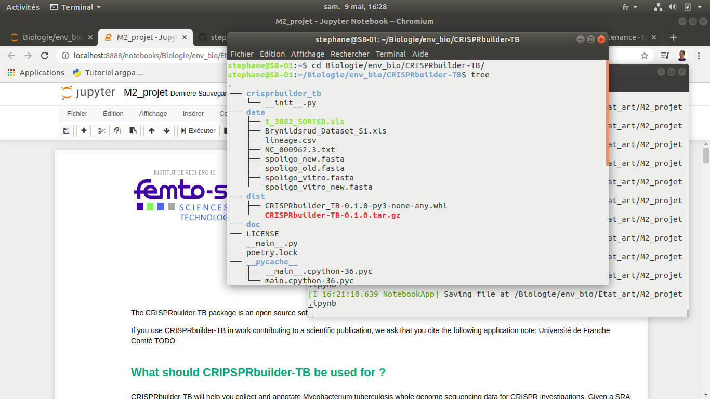

# CRISPRbuilder-TB


The CRISPRbuilder-TB package is an open source software made available under generous terms. Please see the LICENSE file for further details.

If you use CRISPRbuilder-TB in work contributing to a scientific publication, we ask that you cite the following application note: Femto-ST Institute, UMR 6174 CNRS, University of Bourgogne Franche-Comté, France.


## What should CRIPSPRbuilder-TB be used for ?
-----

CRISPRbuilder-TB will help you collect and annotate Mycobacterium tuberculosis whole genome sequencing data for CRISPR investigations. Given a SRA reference, the package will provide information regarding:

* the number of reads for the study,
* the length of those reads,
* the cowerage of the study,
* the source of publication for the SRA reference,
* the authors who discovered it,
* the study accession number,
* the location of discovery,
* the date of discovery,
* the center that discovered the SRA,
* the strain for the SRA,
* the taxid,
* the name of the SRA,
* the reference of the study,
* the bioproject number,
* the spoligotypes,
* the spoligotypes new version,
* the spoligotype numbers,
* the spoligotype new version numbers,
* the spoligotypes vitro,
* the spoligotypes vitro new version,
* the spoligotypes vitro numbers,
* the spoligotypes vitro new version numbers,
* the Spoligotype International Type,
* the Spoligotype International Type silico,
* the affiliation to lineage L6+animal,
* the affiliation to lineage Principal Genotyping Group-cp,
* the affiliation to lineage Principal Genotyping Group,
* the affiliation to lineage Coll,
* the affiliation to lineage Pali,
* the affiliation to lineage Shitikov,
* the affiliation to lineage Stucki


## How to install the package ?
----------------

This package comes with a Command Line Interface, so it should be installed and executed using your conmmand prompt. For Linux, MacOS or Windows platforms, the installation requires the same instruction. Go the the directory you want the package to be stored to and write in your command prompt:

    pip3 install CRISPRbuilder-TB

## How to use the Command Line Interface ?
-----------------

After installing the package, you can find help with the command prompt, listing the different available options, such as **--collect, --list, --add, --print, --remove, --change,** and their expected syntax. Stay in the directory containing CRISPRbuilder-TB and write in the command prompt:

    python3 CRISPRbuilder-TB --help

The help menu will display the following information:

    usage: CRISPRbuilder-TB [-h] [--collect] [--list] [--add] [--remove] [--change] [--print] sra

    Collects and annotates Mycobacterium tuberculosis whole genome sequencing data for CRISPR investigation.

    positional arguments:
      sra         requires the reference of a SRA, the path to a file of SRA references or 0. See doc.

    optional arguments:
      -h, --help  show this help message and exit
      --collect   collects the reference of a SRA to get information about this SRA. See doc.
      --list      collects the path to a file of SRA references to get information about. See doc.
      --add       collects data to add to the file data/lineage.csv. Requires 0 as argument. See doc.
      --remove    removes data from the file data/lineage.csv. Requires 0 as argument. See doc.
      --change    collects data to update the file data/lineage.csv. Requires 0 as argument. See doc.
      --print     prints the file data/lineage.csv. Requires 0 as argument. See doc.

<h3>Execute CRISPRbuilder-TB with a SRA reference</h3>

You can run the package if you wish to find information regarding a specific SRA. From the directory containing the package, use the command prompt to write:

    python3 CRISPRbuilder-TB --collect {SRA_reference}

This package uses the included version 3.6.4 of Python, which is why it is necessary to precise python3 in the command line, in case the default version on your computer would be 2.7.

**Caution:** the instruction above won't work if you're already in the package.

**Exemple:** to find information about SRR8368696

    python3 CRISPRbuilder-TB --collect SRR8368696

### Execute CRISPRbuilder-TB with a list of SRA references

To run the package with a list of SRA references, this list must be composed of one SRA reference per line in a .txt format file. Then, if you wish to find information regarding a list of specific SRAs, stay in the directory containing the package and use the command prompt to write:

    python3 CRISPRbuilder-TB --list {path_to_the_file}

**Exemple:** to find information about the different SRA included in the file **my_file.txt** from the **Documents** directory.

    python3 CRISPRbuilder-TB --list /Documents/my_file.txt

<h3>Print the database lineage.csv</h3>

    python3 CRISPRbuilder-TB --print 0

**Caution:** it is necessary to add the 0 after `--print`.

The command prompt will then display the content of the database **lineage.csv**:

    lineage, Position, Gene coord., Allele change, Codon number, Codon change, Amino acid change, Locus Id, Gene name, Gene type, Type of mutation, 5' gene, 3' gene, Strand, Sublineage surname, Essential, Origin,
    4.1.1, 3798451, , C/G, , GGG/GGC, G/G, Rv3383c, idsB, non essential, syn, 3797437, 398489, -, X, , Stucki et al.,
    4.1.2, 3013784, , C/G, , GTC/CTC, V/L, Rv2697c, dut, ess, non-syn, 3013683, 3014147, -, Haarlem, , Stucki et al.,
    4.1.3, 4409231, , T/G, , GAG/GCG, E/A, Rv3921c, -, ess, 4280033, 4408969, 4410069, -, Ghana, , Stucki et al.,
    4.2, 2181026, , G/C, , CCC/CCG, P/P, Rv1928c, , non essential, syn, 2180450, 2181217, -, -, , Stucki et al., 
    4.3, 1480024, , G/T, , TTC/TTA, F/L, Rv1318c, , non essential, non-syn, 1479199, 1480824, -, LAM, , Stucki et al.,
    4.4, 3966059, , G/C, , ACG/AGG, T/R, Rv3529c, -, non essential, non-syn, 3965884, 3967038, -, -, , Stucki et al.,

<h3>Add a record to lineage.csv</h3>

    python3 CRISPRbuilder-TB --add 0

**Caution:** it is necessary to add the 0 after **--add**.

You will then be asked the values of the different fields (lineage, position, gene coordinates, allege change, codon number, codon change, amino acide change, locus ID, gene name, gene type, type of mutation, 5' gene, 3' gene, strand, sublineage surname, essential, origin of the study). In case you don't know the value of a particular field, just press enter.

<h3>Remove a record from lineage.csv</h3>

    python3 CRISPRbuilder-TB --remove 0

**Caution:** it is necessary to add the 0 after **--remove**.

You will then be asked the reference of the line you wish to delete, which consists of the lineage and the position (see below).

    lineage, Position, Gene coord., Allele change, Codon number, Codon change, Amino acid change, Locus Id, Gene name, Gene type, Type of mutation, 5' gene, 3' gene, Strand, Sublineage surname, Essential, Origin,
    4.1.1, 3798451, , C/G, , GGG/GGC, G/G, Rv3383c, idsB, non essential, syn, 3797437, 398489, -, X, , Stucki et al.,
    4.1.2, 3013784, , C/G, , GTC/CTC, V/L, Rv2697c, dut, ess, non-syn, 3013683, 3014147, -, Haarlem, , Stucki et al.,
    4.1.3, 4409231, , T/G, , GAG/GCG, E/A, Rv3921c, -, ess, 4280033, 4408969, 4410069, -, Ghana, , Stucki et al.,
    4.2, 2181026, , G/C, , CCC/CCG, P/P, Rv1928c, , non essential, syn, 2180450, 2181217, -, -, , Stucki et al., 
    4.3, 1480024, , G/T, , TTC/TTA, F/L, Rv1318c, , non essential, non-syn, 1479199, 1480824, -, LAM, , Stucki et al.,
    4.4, 3966059, , G/C, , ACG/AGG, T/R, Rv3529c, -, non essential, non-syn, 3965884, 3967038, -, -, , Stucki et al.,

<h3>Change a record from lineage.csv</h3>

    python3 CRISPRbuilder-TB --change 0

**Caution:** it is necessary to add the 0 after **--change**.

You will then be asked the reference of the line you wish to delete, which consists of the lineage and the position (see below).

    lineage, Position, Gene coord., Allele change, Codon number, Codon change, Amino acid change, Locus Id, Gene name, Gene type, Type of mutation, 5' gene, 3' gene, Strand, Sublineage surname, Essential, Origin,
    4.1.1, 3798451, , C/G, , GGG/GGC, G/G, Rv3383c, idsB, non essential, syn, 3797437, 398489, -, X, , Stucki et al.,
    4.1.2, 3013784, , C/G, , GTC/CTC, V/L, Rv2697c, dut, ess, non-syn, 3013683, 3014147, -, Haarlem, , Stucki et al.,
    4.1.3, 4409231, , T/G, , GAG/GCG, E/A, Rv3921c, -, ess, 4280033, 4408969, 4410069, -, Ghana, , Stucki et al.,
    4.2, 2181026, , G/C, , CCC/CCG, P/P, Rv1928c, , non essential, syn, 2180450, 2181217, -, -, , Stucki et al., 
    4.3, 1480024, , G/T, , TTC/TTA, F/L, Rv1318c, , non essential, non-syn, 1479199, 1480824, -, LAM, , Stucki et al.,
    4.4, 3966059, , G/C, , ACG/AGG, T/R, Rv3529c, -, non essential, non-syn, 3965884, 3967038, -, -, , Stucki et al.,

You will then be asked the values of the different fields: lineage, position, gene coordinates, allege change, codon number, codon change, amino acide change, locus ID, gene name, gene type, type of mutation, 5' gene, 3' gene, strand, sublineage surname, essential, origin of the study. In case you don't know the value of a particular field, just press enter.

## Composition of the package and dependencies
----------------------

CRISPRbuilder-TB needs the following dependencies to work:

* python = "^3.7"
* xlrd = "^1.2.0"
* openpyxl = "^3.0.3"
* xmltodict = "^0.12.0"
* biopython = "^1.76"
* datetime = "^4.3"
* parallel-fastq-dump
* balstn+

These different versions are automatically downloaded when installing the CRISPRbuilder-TB package.

The package structure is the following:



The **\_\_main\_\_.py** file contains the actual code for the package.<br/>
The **data** directory contains the necessary database to compare with the SRA reference when the code is executed.<br/>
The **REP/sequences** directory contains the different result database for each execution of the code. That's typically where you can find fasta format files regarding a specific SRA you've asked for.<br/>
The **doc** directory contains the necessary documentation to explain how this package works. It includes a **README.md** file explaining how to install the package for those who just need the essential, the copiright conditions for this package with the **LICENSE** file and the present notebook.

## Retrieving the genome information dictionary
--------------------------

## Breaking down the code
------------------

Supposing you're looking for information regarding ERR2704808. After writing python3 CRISPRbuilder-TB --collect ERR2704808 in the shell, a directory called ERR2704808 will be created in REP/sequences and the item ERR2704808 will be added to the database. Then the files in fasta format will be downloaded in REP/sequences/ERR2704808 as in the following code:


```python
if len([u for u in listdir(rep) if 'fasta' in u]) == 0:
    print("We're downloading the files in fasta format")

    completed = subprocess.run(['parallel-fastq-dump', '-t', '8', '--split-files', '--fasta', '-O', P_REP, '-s', item])
        
    # if the download worked
    if completed.returncode == 0:
        print("fasta files successfully downloaded.")
        for k in listdir(P_REP):
            if k.endswith('.fasta'):
                p = str(PurePath('REP', 'sequences', item, k))
                p_k = str(PurePath('REP', k))
                move(p_k, p)
```

The ERR2704808_1.fasta and ERR2704808_2.fasta files will then be mixed in a new ERR2704808_shuffled.fasta file as in the following code:


```python
print("We're mixing both fasta files, which correspond to the two splits ends.")

if name == 'posix':
    for fic in ['_1', '_2']:
        system("sed -i 's/" + item + './' + item + fic + "./g' REP/sequences/" + item + "/" + item + fic + '.fasta')
    system("cat REP/sequences/" + item + "/" + item + "_1.fasta " + "REP/sequences/" + item + "/" + item + "_2.fasta > REP/sequences/" + item + "/" + item + "_shuffled.fasta")
```

The number of '>' in ERR2704808_shuffled.fasta, representing the number of reads, is being counted and assigned to nb, as in the following code:


```python
if 'nb_reads' not in dico_afr[item] or dico_afr[item]['nb_reads'] == '':
    if name == 'posix':
        system("cat REP/sequences/" + item + "/" + item + "_shuffled.fasta | grep '>' | wc -l > /tmp/nb.txt")
    nb = eval(open(P_TXT).read().split('\n')[0])
```

The length of the reads is also being updated, as in the following code:


```python
if 'len_reads' not in dico_afr[item]:
    len_nb = len(''.join(open(p_shuffled).read(10000).split('>')[1].split('\n')[1:]))
```

Then, a database for blast called ERR2704808 is being created in REP/sequences/ERR2704808/ERR2704808, as in the code:


```python
if item+'.nal' not in listdir(rep) and item+'.nin' not in listdir(rep):
    print("We're creating a database for Blast")
    completed = subprocess.run(['makeblastdb', '-in', p_shuffled, '-dbtype', 'nucl', '-title', item, '-out', repitem])
```

Sequences from the fasta files are added and the spoligotypes are being blasted, as in the code:


```python
 if 'spoligo' not in dico_afr[item] or dico_afr[item]['spoligo'] == '':
        print(f"The spoligotypes are being blasted")

        p_spoligo_old = str(PurePath('data', 'spoligo_old.fasta'))
        p_spoligo_new = str(PurePath('data', 'spoligo_new.fasta'))
        p_old_blast = str(PurePath('/tmp/' + item + "_old.blast"))
        p_new_blast = str(PurePath('/tmp/' + item + "_new.blast"))

        completed = subprocess.run("blastn -num_threads 12 -query " + p_spoligo_old + " -evalue 1e-6 -task blastn -db " + repitem + " -outfmt '10 qseqid sseqid sstart send qlen length score evalue' -out " + p_old_blast, shell=True)

        completed = subprocess.run("blastn -num_threads 12 -query " + p_spoligo_new + " -evalue 1e-6 -task blastn -db " + repitem + " -outfmt '10 qseqid sseqid sstart send qlen length score evalue' -out " + p_new_blast, shell=True)

        for pos, spol in enumerate(['old', 'new']):
            p_blast = str(PurePath('/tmp/' + item + '_' + spol + '.blast'))
            p_fasta = str(PurePath('data', 'spoligo_' + spol + '.fasta'))

            with open(p_blast) as f:
                matches = f.read()
                nb = open(p_fasta).read().count('>')
                for k in range(1, nb + 1):
                    if matches.count('espaceur' + spol.capitalize() + str(k) + ',') >= 5:
                        dico_afr[item]['spoligo' + ['', '_new'][pos]] += '\u25A0'
                    else:
                            dico_afr[item]['spoligo' + ['', '_new'][pos]] += '\u25A1'

            dico_afr[item]['spoligo' + ['', '_new'][pos] + '_nb'] = [matches.count('espaceur' + spol.capitalize() + str(k) + ',') for k in range(1, nb + 1)]
```

Applying this code, the programm displays the following information:

<pre style="background-color:#b8b894">spoligo: ■□□■■■■□□□□□■■■■■■■■□□□□■■■□□■■■■■■■□□□■■■■

spoligo_nb: [294, 0, 0, 283, 316, 284, 298, 0, 0, 0, 0, 0, 290, 331, 304, 324, 279, 259, 284, 357, 0, 0, 0, 0, 500, 296, 315, 0, 0, 351, 273, 312, 341, 299, 309, 339, 0, 0, 0, 230, 254, 277, 294]

spoligo_new: ■■□□■■■■■■■■■■■■□□□□□□■■■■■■■■□□□□■■■□□■■■■■■■■■■■□□□□□□□□□□■■■■■■■■□□□□□□□□□□□□□□□□□□□□□□□□□□□□□□

spoligo_new_nb: [295, 294, 0, 0, 258, 309, 359, 321, 310, 258, 300, 283, 316, 284, 298, 310, 0, 0, 0, 0, 0, 0, 290, 331, 304, 324, 279, 259, 284, 357, 0, 0, 0, 0, 500, 296, 315, 0, 0, 351, 273, 312, 341, 299, 293, 309, 339, 309, 297, 306, 0, 0, 0, 0, 0, 0, 0, 0, 0, 0, 299, 230, 254, 277, 294, 275, 307, 323, 0, 0, 0, 0, 0, 0, 0, 0, 0, 0, 0, 0, 0, 0, 0, 0, 0, 0, 0, 0, 0, 0, 0, 0, 0, 0, 0, 0, 0, 0]</pre>

The same process is applied to the spoligotypes_vitro.

<pre style="background-color:#b8b894">spoligo_vitro: ■□□■■■■□□□□□■■■■■■■■□□□□■■■□□■■■■■■■□□□■■■■

spoligo_vitro_nb: [(327, 314), (0, 0), (0, 0), (303, 302), (360, 353), (332, 310), (342, 334), (0, 0), (0, 0), (0, 0), (0, 0), (0, 0), (346, 334), (357, 359), (345, 336), (345, 354), (310, 301), (291, 287), (297, 327), (391, 382), (0, 0), (0, 0), (0, 0), (0, 0), (500, 500), (332, 321), (346, 362), (0, 0), (0, 0), (377, 371), (312, 297), (338, 356), (401, 364), (343, 341), (329, 339), (368, 363), (0, 0), (0, 0), (0, 0), (269, 270), (289, 270), (331, 305), (333, 327)]

spoligo_vitro_new: ■■□□■■■■■■■■■■■■□□□□□□■■□■■■■■□□□□■■■□□■■■■■■■■■■■□□□□□□□□□□■■■■■■■■□□□□□□□□□□□□□□□□□□□□□□□□□□□□□□

spoligo_vitro_new_nb: [(347, 325), (327, 314), (0, 0), (0, 0), (298, 280), (338, 353), (396, 396), (375, 355), (351, 335), (288, 285), (329, 329), (303, 302), (360, 353), (332, 310), (342, 334), (344, 329), (0, 0), (0, 0), (0, 0), (0, 0), (0, 0), (0, 0), (346, 334), (357, 359), (0, 301), (345, 354), (310, 301), (291, 287), (297, 327), (391, 382), (0, 0), (0, 0), (0, 0), (0, 0), (500, 500), (332, 321), (346, 362), (0, 0), (0, 0), (377, 371), (312, 297), (338, 356), (401, 364), (343, 341), (341, 326), (329, 339), (368, 363), (341, 337), (338, 337), (362, 338), (0, 0), (0, 0), (0, 0), (0, 0), (0, 0), (0, 0), (0, 0), (0, 0), (0, 0), (0, 0), (336, 338), (269, 270), (289, 270), (331, 305), (332, 327), (313, 293), (322, 335), (347, 371), (0, 0), (0, 0), (0, 0), (0, 0), (0, 0), (0, 0), (0, 0), (0, 0), (0, 0), (0, 0), (0, 0), (0, 0), (0, 0), (0, 0), (0, 0), (0, 0), (300, 0), (0, 0), (0, 0), (0, 0), (0, 0), (0, 0), (0, 0), (0, 0), (0, 0), (0, 0), (0, 0), (0, 0), (0, 0), (0, 0)]</pre>

Finally, the lineage is defined by comparing the blast files with the different lineages L6+animal, PGG, PGG-cp, Coll, Pali, Shitikov and Stucki. 


```python
if 'lineage_Pali' not in dico_afr[item]:
    lignee = []
    Lignee_SNP = to_reads('Pali', H37RV)
    print("We're adding the lineage according to the SNPs Pali")

    for item2, pos0 in enumerate(Lignee_SNP):
        seq1, seq2 = Lignee_SNP[pos0][:2]

        p_blast = str(PurePath('/tmp/snp_Pali.blast'))
        with open(P_FASTA, 'w') as f:
            f.write('>\n' + seq2)
        cmd = "blastn -query " + P_FASTA + " -num_threads 12 -evalue 1e-5 -task blastn -db " + repitem + " -outfmt '10 sseq' -out " + p_blast
        system(cmd)
        
        with open(p_blast) as f:
            formatted_results = f.read().splitlines()

        nb_seq1 = to_nb_seq(seq1, formatted_results, 16, 20, 21, 25)
        nb_seq2 = to_nb_seq(seq2, formatted_results, 16, 20, 21, 25)

        if nb_seq2 > nb_seq1:
            lignee.append(Lignee_SNP[pos0][2])

    lignee = [u for u in sorted(set(lignee))]

    dico_afr[item]['lineage_Pali'] = lignee
```

<pre style="background-color:#b8b894">lineage_L6+animal: 1
lineage_PGG_cp: ['1', 'X']
lineage_PGG: X
lineage_Coll: ['4', '4.9', '5']
lineage_Pali: ['1']
lineage_Shitikov: []
Lignee_Stucki: ['4.10']</pre>


```python

```


```python

```


```python

```


wwb = open_workbook('../data/Coll_62_SNPs_(copie).xlsx')
wws = wwb.sheet_by_index(0)

for row in range(1, wws.nrows):

    chaine = str(wws.cell_value(row, 0)).lstrip('lineage').replace('*', '')
    chaine = chaine.strip() + ','
    for i in range(1, 17):
        chaine += str(wws.cell_value(row, i)).replace('.0', '').strip()+','
        liste_SRA = chaine.strip().split(',')
    with open('lineage.csv', 'a', newline='') as file:
        c = csv.writer(file, delimiter=',', quotechar='"',
                       quoting=csv.QUOTE_MINIMAL)
        c.writerow(liste_SRA)

with open('lineage.csv', 'r', newline='') as f:
    spreader = csv.reader(f, delimiter=',', quotechar='"')
    for row in spreader:
        print(', '.join(row))
        Pour transformer xlsx en csv

```python

```
